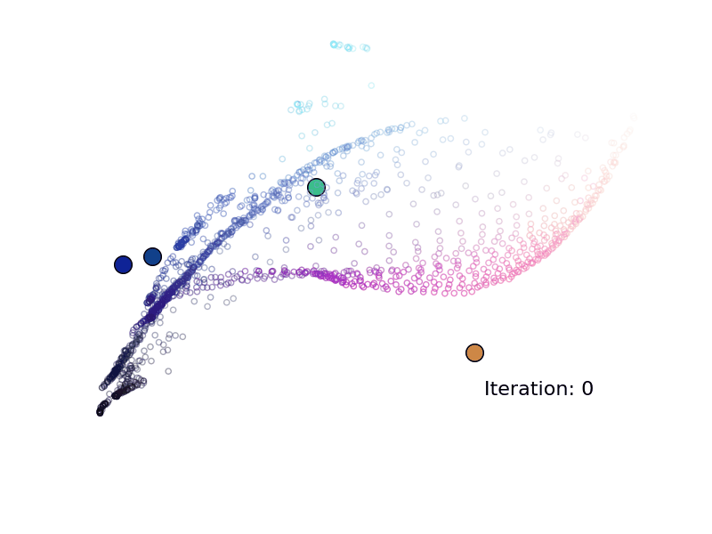
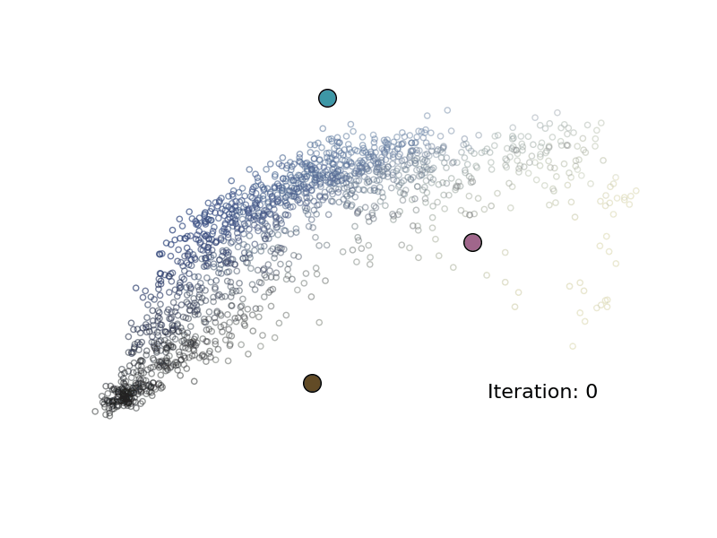

# k-Means Visualizer
This program uses the k-means clustering algorithm to determine k colors that are representative of a provided image. The visualization for the algorithm is made from 3D scatter plots of pixel values with Matplotlib.

## What is k-means clustering?
K-means clustering is an unsupervised machine learning algorithm that finds k clusters within a given dataset. The algorithm begins by defining k centroids, around which each cluster will be created. A cluster of a centroid is defined as all members of the dataset (in this case, pixels RGB values) which are closest to that given centroid. Next, when all members of the data set are assigned to the closest centroid, the algorithm moves each centroid to the mean of the cluster. The algorithm continues to iterate by creating clusters and updating the centroids until no centroids move during an iteration.

## Examples
#### 1) [Image Link](https://c4.wallpaperflare.com/wallpaper/778/821/245/minimalism-minimal-art-minimalist-airplane-wallpaper-preview.jpg) (k = 4)
  

    
    
    
    
  

  
#### 2) Starry Night (k = 3)
  

    
    
    
    
  

